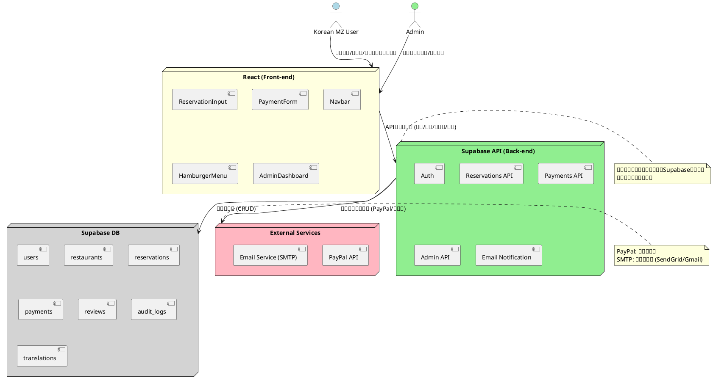

以下は、これまでの情報を基に、IRU TOMOのシステムアーキテクチャ設計（3-1）をPlantUMLで視覚化し、わかりやすく構造化・清書した資料です。現在の日付（2025年2月27日）を踏まえ、韓国人MZ世代向けのMVPフェーズ（React、Supabase、PayPal統合）を考慮して、システム構成図、技術スタック選定、フロントエンド、バックエンド、インフラ構成を詳細に記述します。

---

## 3-1. システムアーキテクチャ設計

### 1. システム構成図
IRU TOMOのシステム全体の構成をPlantUMLで表現します。アクター（ユーザー、管理者）、フロントエンド（React）、バックエンド（Supabase API）、データベース（Supabase DB）、外部サービス（PayPal、メール送信）を示します。

### 2. 技術スタック選定
IRU TOMOのMVPフェーズに適した技術スタックを以下にまとめます。

- **全体の哲学**:
  - 韓国人MZ世代向けのシンプルで直感的、モバイル対応の体験を提供。
  - 初期コストを抑えつつ、スケーラビリティを確保。

- **選択理由**:
  - ReactとSupabaseはノーコード・ローコード環境（Bolt.new以前の経験）を考慮し、迅速なプロトタイピングとデータ管理が可能。
  - PayPalは国際的な支払い処理をサポートし、韓国人ユーザーのニーズに適合。
  - 多言語対応（日本語、英語、韓国語）をサポートするため、i18nライブラリやSupabaseの柔軟なデータ構造を活用。

#### 技術スタック
| レイヤ     | 技術                          | 理由                                                                 |
|------------|-------------------------------|----------------------------------------------------------------------|
| フロントエンド | React, Chakra UI/Tailwind CSS | モバイルファースト、レスポンシブデザイン、UI/UXの迅速な実装          |
| バックエンド   | Supabase Functions (Node.js)  | サーバーレスアーキテクチャ、Supabaseとの統合の容易さ                |
| データベース   | Supabase PostgreSQL           | スケーラブルなRDBMS、リアルタイム機能、RLS（行レベルセキュリティ）  |
| 認証          | Supabase Auth                 | 簡単なJWT認証、ロールベースアクセス制御（RBAC）                      |
| 支払い処理     | PayPal REST/Checkout API      | 国際的な支払い対応、モバイル対応、韓国人ユーザーの信頼性             |
| メール送信     | Nodemailer + SendGrid/Gmail   | コスト効率の良いSMTPサービス、多言語メール対応                       |
| インフラ       | Supabase Cloud, Google Cloud  | クラウドネイティブ、無料プランで初期対応可能、スケーラビリティ確保   |

### 3. フロントエンド
- **技術**:
  - React（バージョン18以上、Hooksを使用）。
  - Chakra UIまたはTailwind CSS（レスポンシブデザインとブランドカラー：オレンジ#FF8C00、白#FFFFFF）。
  - `@paypal/react-paypal-js`（PayPalボタンの統合）。
  - `react-i18n`または`i18next`（多言語対応：日本語、英語、韓国語）。

- **コンポーネント**:
  - `ReservationInput`: 予約日時、人数、名前、電話番号、メールアドレスを入力。
  - `PaymentForm`: PayPalボタンと人数ベースの金額表示。
  - `Navbar`: 通常ナビゲーション（デスクトップ：「ホーム」「予約へ進む」「店舗情報」「ログイン」）。
  - `HamburgerMenu`: ハンバーガーメニュー（モバイル：「ホーム」「予約へ進む」「オプション」「注文状況」「店舗情報」「注意事項」「管理者ダッシュボード」「ログイン」）。
  - `AdminDashboard`: 管理者専用予約確認（フィルタリング、確認、キャンセル機能）。

- **機能**:
  - スクロール対応のハンバーガーメニュー（`position: fixed`）。
  - 多言語切り替え（`language_preference`に基づく）。
  - アクセシビリティ（WCAG 2.1 AA準拠、スクリーンリーダー対応）。

### 4. バックエンド
- **技術**:
  - Supabase Functions（Node.js/Express、サーバーレス）。
  - Supabase Auth（JWTベースの認証）。
  - PayPal REST/Checkout API（支払い処理）。
  - Nodemailer（メール送信、SendGrid/Gmail統合）。

- **APIエンドポイント**:
  - `POST /api/reservations`: 予約データの保存（`reservations`テーブル）。
  - `POST /api/paypal/checkout`: PayPal支払いリクエスト（人数ベースの金額計算）。
  - `POST /api/paypal/confirm`: 支払い完了確認とデータ更新（`reservations`、`payments`）。
  - `GET /api/admin/reservations`: 管理者用予約リスト取得。
  - `POST /api/admin/confirm`: 予約確認。
  - `POST /api/admin/cancel`: 予約キャンセル。
  - `POST /api/email/notify`: メール通知送信（多言語対応）。

- **機能**:
  - ロールベースアクセス制御（`role`による管理者/ユーザー分離）。
  - エラーログ記録（`audit_logs`テーブル）。
  - タイムゾーン対応（UTC保存、表示時変換）。

### 5. インフラ構成
- **構成**:
  - **Supabase Cloud**:
    - データベース（PostgreSQL）：`users`、`restaurants`、`reservations`、`payments`、`reviews`、`audit_logs`、`translations`。
    - API（Supabase Functions）：サーバーレスAPIホスティング。
    - Auth（Supabase Auth）：JWTベース認証、ロール管理。
  - **Google Cloud**（オプション）:
    - ログ分析（Stackdriver Logging）。
    - スケーラビリティ向上（Cloud RunやCompute Engine）。

- **外部サービス**:
  - **PayPal API**: 支払い処理（Live環境、初期はSandboxでテスト）。
  - **Email Service**: SendGrid/Gmail（SMTPでメール送信、初期は無料プラン）。

- **スケーラビリティ**:
  - 初期：Supabase無料プラン（10万行、2GBストレージ）、PayPal Sandbox、SendGrid無料プラン。
  - 成長時：Supabase有料プラン、PayPalプレミアムプラン、SendGrid低コストプラン。

- **セキュリティ**:
  - RLS（行レベルセキュリティ）でデータアクセス制御。
  - HTTPS（SupabaseとGoogle Cloudのデフォルト）。
  - APIキーのセキュア管理（環境変数、Secrets Manager）。

---

### 補足
- **PlantUMLの生成**:
  - 上記のPlantUMLコードをPlantUMLツール（オンラインエディタやプラグイン）に入力し、PNGやSVG形式で構成図を生成できます。
  - 図はIRU TOMOのブランドカラー（オレンジ#FF8C00、白#FFFFFF）を反映し、韓国人MZ世代に訴求する視覚的デザインを採用。

- **MVPフェーズの考慮**:
  - 初期は手動運用（スタッフがSupabaseで確認）を前提とし、将来的に自動化を計画。
  - コスト効率を重視し、無料プランでスタート。
