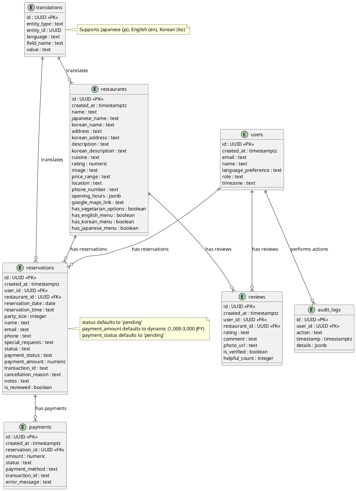

以下は、これまでの情報を基に、IRU TOMOのデータベース設計（3-2）をPlantUMLでER図を視覚化し、テーブル定義書をSQLで記述して、わかりやすく構造化・清書した資料です。現在の日付（2025年2月27日）を踏まえ、韓国人MZ世代向けのMVPフェーズ（React、Supabase、PayPal統合）を考慮して、ER図と主要テーブル定義を詳細に記述します。

---

## 3-2. データベース設計

### 1. ER図
IRU TOMOのデータベーススキーマ（`users`、`restaurants`、`reservations`、`payments`、`reviews`、`audit_logs`、`translations`）をPlantUMLで表現します。関係性（外部キーや1対多）を明確に示します。



### 2. テーブル定義書
IRU TOMOの主要テーブルをSQLで定義します。Supabase（PostgreSQL）を基盤とし、MVPフェーズに必要な制約（主キー、外部キー、デフォルト値、NOT NULL）を設定します。

```sql
-- 主要テーブル定義例

-- users テーブル: ユーザー情報
CREATE TABLE users (
    id UUID PRIMARY KEY DEFAULT gen_random_uuid(), -- ユーザーID
    created_at TIMESTAMPTZ DEFAULT NOW(), -- 作成日時
    email TEXT NOT NULL UNIQUE, -- メールアドレス（一意）
    name TEXT NOT NULL, -- ユーザー名
    language_preference TEXT NOT NULL DEFAULT 'ko' CHECK (language_preference IN ('ja', 'en', 'ko')), -- 言語設定（日本語、英語、韓国語）
    role TEXT NOT NULL DEFAULT 'user' CHECK (role IN ('admin', 'staff', 'user')), -- 役割
    timezone TEXT NOT NULL DEFAULT 'Asia/Tokyo' -- タイムゾーン
);

-- restaurants テーブル: レストラン情報
CREATE TABLE restaurants (
    id UUID PRIMARY KEY DEFAULT gen_random_uuid(), -- レストランID
    created_at TIMESTAMPTZ DEFAULT NOW(), -- 作成日時
    name TEXT NOT NULL, -- レストラン名（一般）
    japanese_name TEXT NOT NULL, -- 日本語名
    korean_name TEXT NOT NULL, -- 韓国語名
    address TEXT NOT NULL, -- 住所
    korean_address TEXT NOT NULL, -- 韓国語住所
    description TEXT NOT NULL, -- 説明（一般）
    korean_description TEXT NOT NULL, -- 韓国語説明
    cuisine TEXT NOT NULL, -- 料理ジャンル
    rating NUMERIC, -- 評価（0〜5）
    image TEXT, -- 画像URL
    price_range TEXT NOT NULL, -- 価格帯（例: '低価格帯', '中価格帯', '高価格帯'）
    location TEXT NOT NULL, -- 地域（例: '大阪'）
    phone_number TEXT NOT NULL, -- 電話番号
    opening_hours JSONB NOT NULL, -- 営業時間（JSON形式）
    google_maps_link TEXT NOT NULL, -- Google Mapsリンク
    has_vegetarian_options BOOLEAN NOT NULL DEFAULT false, -- ベジタリアンオプションの有無
    has_english_menu BOOLEAN NOT NULL DEFAULT false, -- 英語メニューの有無
    has_korean_menu BOOLEAN NOT NULL DEFAULT false, -- 韓国語メニューの有無
    has_japanese_menu BOOLEAN NOT NULL DEFAULT true -- 日本語メニューの有無
);

-- reservations テーブル: 予約情報
CREATE TABLE reservations (
    id UUID PRIMARY KEY DEFAULT gen_random_uuid(), -- 予約ID
    created_at TIMESTAMPTZ DEFAULT NOW(), -- 作成日時
    user_id UUID NOT NULL REFERENCES users(id) ON DELETE CASCADE, -- ユーザーID（外部キー）
    restaurant_id UUID NOT NULL REFERENCES restaurants(id) ON DELETE CASCADE, -- レストランID（外部キー）
    reservation_date DATE NOT NULL, -- 予約日
    reservation_time TEXT NOT NULL, -- 予約時間
    party_size INTEGER NOT NULL CHECK (party_size BETWEEN 1 AND 12), -- 人数（1〜12）
    name TEXT NOT NULL, -- 予約者名
    email TEXT NOT NULL, -- メールアドレス
    phone TEXT NOT NULL, -- 電話番号
    special_requests TEXT, -- 特別リクエスト
    status TEXT NOT NULL DEFAULT 'pending' CHECK (status IN ('pending', 'confirmed', 'cancelled')), -- 予約ステータス
    payment_status TEXT NOT NULL DEFAULT 'pending' CHECK (payment_status IN ('pending', 'completed', 'failed')), -- 支払いステータス
    payment_amount NUMERIC NOT NULL DEFAULT (CASE WHEN party_size BETWEEN 1 AND 4 THEN 1000 WHEN party_size BETWEEN 5 AND 8 THEN 2000 WHEN party_size BETWEEN 9 AND 12 THEN 3000 ELSE 0 END), -- 支払い金額（人数ベース）
    transaction_id TEXT, -- PayPal取引ID
    cancellation_reason TEXT, -- キャンセル理由
    notes TEXT, -- 備考
    is_reviewed BOOLEAN NOT NULL DEFAULT false -- レビュー済みか
);

-- payments テーブル: 支払い情報
CREATE TABLE payments (
    id UUID PRIMARY KEY DEFAULT gen_random_uuid(), -- 支払いID
    created_at TIMESTAMPTZ DEFAULT NOW(), -- 作成日時
    reservation_id UUID NOT NULL REFERENCES reservations(id) ON DELETE CASCADE, -- 予約ID（外部キー）
    amount NUMERIC NOT NULL, -- 支払い金額
    status TEXT NOT NULL CHECK (status IN ('completed', 'failed')), -- 支払いステータス
    payment_method TEXT NOT NULL DEFAULT 'PayPal', -- 支払い方法
    transaction_id TEXT NOT NULL, -- PayPal取引ID
    error_message TEXT -- エラーメッセージ
);

-- reviews テーブル: レビュー情報
CREATE TABLE reviews (
    id UUID PRIMARY KEY DEFAULT gen_random_uuid(), -- レビューID
    created_at TIMESTAMPTZ DEFAULT NOW(), -- 作成日時
    user_id UUID NOT NULL REFERENCES users(id) ON DELETE CASCADE, -- ユーザーID（外部キー）
    restaurant_id UUID NOT NULL REFERENCES restaurants(id) ON DELETE CASCADE, -- レストランID（外部キー）
    rating TEXT NOT NULL, -- 評価（例: '5 stars'）
    comment TEXT, -- コメント
    photo_url TEXT, -- 写真URL
    is_verified BOOLEAN NOT NULL DEFAULT false, -- 検証済みか
    helpful_count INTEGER NOT NULL DEFAULT 0 -- 役に立ったカウント
);

-- audit_logs テーブル: 監査ログ
CREATE TABLE audit_logs (
    id UUID PRIMARY KEY DEFAULT gen_random_uuid(), -- ログID
    user_id UUID NOT NULL REFERENCES users(id) ON DELETE CASCADE, -- ユーザーID（外部キー）
    action TEXT NOT NULL, -- 操作内容（例: 'confirm_reservation'）
    timestamp TIMESTAMPTZ NOT NULL DEFAULT NOW(), -- 操作時刻
    details JSONB NOT NULL -- 詳細（JSON形式）
);

-- translations テーブル: 多言語翻訳
CREATE TABLE translations (
    id UUID PRIMARY KEY DEFAULT gen_random_uuid(), -- 翻訳ID
    entity_type TEXT NOT NULL, -- 翻訳対象（例: 'restaurant', 'reservation'）
    entity_id UUID NOT NULL, -- 対象エンティティID
    language TEXT NOT NULL CHECK (language IN ('ja', 'en', 'ko')), -- 言語（日本語、英語、韓国語）
    field_name TEXT NOT NULL, -- 翻訳対象フィールド（例: 'description', 'name'）
    value TEXT NOT NULL -- 翻訳値
);

-- RLS（行レベルセキュリティ）設定例
ALTER TABLE reservations ENABLE ROW LEVEL SECURITY;
CREATE POLICY "Users can view/edit own reservations"
  ON reservations
  FOR ALL
  TO authenticated_users
  USING (auth.uid() = user_id)
  WITH CHECK (auth.uid() = user_id);

CREATE POLICY "Admin can manage all reservations"
  ON reservations
  FOR ALL
  TO authenticated_users
  USING (exists (
    SELECT 1 FROM users WHERE users.id = auth.uid() AND users.role = 'admin'
  ));
```

### 3. 補足
- **ER図の説明**:
  - 1対多の関係を`||--o{`で表現（例: `users` → `reservations`）。
  - 主キー（`<<PK>>`）と外部キー（`<<FK>>`）を明示。
  - 注釈でデフォルト値や多言語対応を説明。

- **テーブル定義の特徴**:
  - UUIDを主キーとして使用（`gen_random_uuid()`で生成）。
  - タイムスタンプ（`timestamptz`）でタイムゾーン対応。
  - 制約（NOT NULL、CHECK、FOREIGN KEY）でデータの一貫性を確保。
  - 人数ベースの`payment_amount`を動的計算（`CASE WHEN`使用）。
  - RLSでセキュリティを強化（ユーザーと管理者のアクセス制御）。

- **MVPフェーズの考慮**:
  - 初期は手動運用（スタッフがSupabaseでデータを確認）。
  - 無料プラン（Supabase 10万行、2GBストレージ）で対応可能。

この資料は、IRU TOMOの要件を満たし、将来の拡張性も考慮したものです。追加の質問や具体的なSQL調整が必要な場合は、お知らせください！